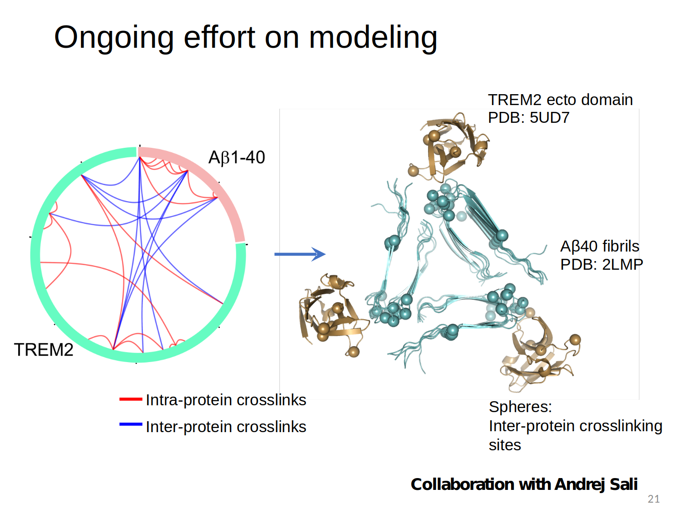

# Modeling Protein complexes in aggregative diseases
# TREM2:Abeta complex (in collaboration with DeGrado group)
# Hsp70:CHIP:tau complexe (in collaboration with Southworth group)

**This project***

TREM2:Abeta complex (in collaboration with DeGrado group)

